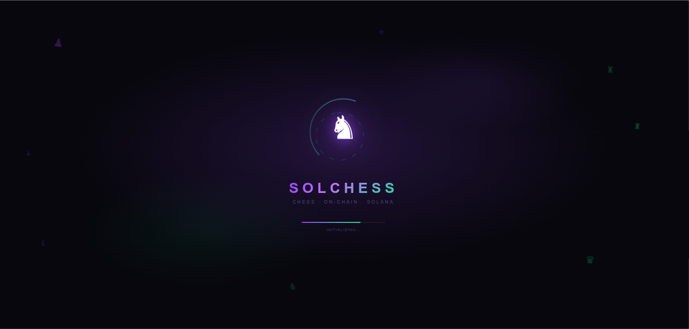
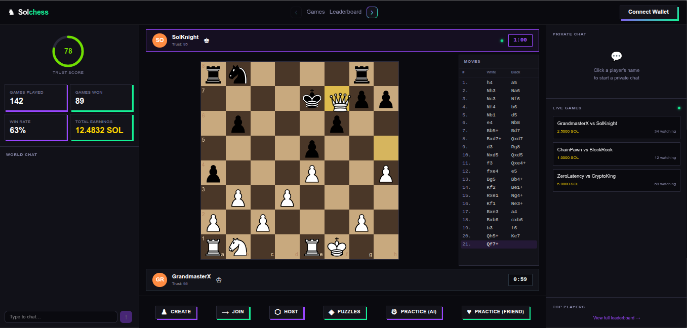

# SolChess

> Real-time multiplayer chess with trustless on-chain wagers, powered by Solana.

---

## What is SolChess?

SolChess is a competitive chess platform where every game is backed by real stakes. Players wager SOL when they create or join a game — funds are locked in a smart contract escrow the moment the game begins and automatically paid out to the winner when it ends. No middleman. No trust required.

Beyond the game itself, spectators can stake SOL on the player they think will win and claim their share of the winnings at the end. Every game is a live event.

---



## How It Works

1. **Create a game** — set your wager, choose your color, lock your SOL into escrow on-chain
2. **Opponent joins** — they lock their own wager into the same escrow (amounts can differ)
3. **Game starts** — a stake window opens for spectators to back either side
4. **Game ends** — the smart contract settles automatically: winner gets the full pot minus a small platform fee, spectators on the winning side claim their returns

---

## Features

- **Trustless wager escrow** — SOL locked on-chain at game start, no manual intervention needed
- **Asymmetric wagers** — creator and joiner can stake different amounts
- **Spectator staking** — back a player mid-game and earn if they win
- **Hosted events** — create a game you watch as a spectator, two others play
- **Practice mode** — play without wagers for free
- **Live multiplayer** — real-time move relay, timers, and game state via WebSocket
- **World chat** — live chat across all active games
- **Leaderboard** — ranked by trust score and performance
- **Game codes** — share a 6-character code to invite a specific opponent

---

## Architecture

```
SolChess/
├── frontend/       React + Vite + TypeScript — UI, wallet adapter, Anchor client
├── backend/        Fastify + Prisma + Socket.io — game logic, move relay, REST API
└── solchess/       Anchor (Rust) — on-chain escrow, staking, settlement program
```

Each folder has its own README with setup and configuration details.

---

## On-Chain Program

- **Network:** Solana Devnet → Mainnet
- **Program ID:** `HCVLAPtDATPRCsGAHbFJKBmahQsjLK9QehXLna12c7NT`
- **Framework:** Anchor 0.32.1

The program handles:
- Game escrow creation and joining
- Spectator stake pool management
- Winner settlement with automatic fee split
- Platform config (admin, authority, treasury)

---

## Tech Stack

| Layer | Technology |
|-------|-----------|
| Frontend | React, TypeScript, Vite, Tailwind CSS |
| Wallet | `@solana/wallet-adapter-react` |
| Chess | `react-chessboard`, `chess.js` |
| Backend | Fastify, TypeScript, Socket.io |
| Database | PostgreSQL via Prisma |
| On-chain | Anchor (Rust), Solana Web3.js |

---

